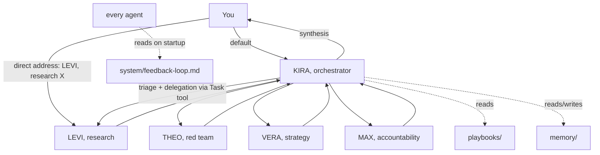

# KIRA Agent System

A file-based multi-agent system for Claude Code: one orchestrator, a bench of specialist agents, skills and playbooks as versioned markdown, per-agent memory with hard caps, and a feedback loop that turns corrections into rules. In daily use by its author since March 2026.

This is not a framework. There is no code to install and no abstraction layer. The entire system is plain markdown files that Claude Code reads, which means you can read every rule the system follows, diff every change, and adapt it by editing text.

## How it works

The diagram shows the four specialists included in this repository. The orchestrator's routing table references a larger bench (content, wellbeing, enablement personas); those shipped in the private version and are left as named routes here so you can see the full topology. Build your own from `skills/_template/`.

Three ideas carry the system:

1. **KIRA-first routing with a direct-address escape hatch.** You talk to the orchestrator by default and it triages. But saying "LEVI, research X" bypasses triage and spawns that agent directly, like walking up to someone's desk. The routing table lives in `KIRA-INSTRUCTIONS.md`.
2. **Task-scoped context loading.** Every delegation lists only the context files the target agent needs for that specific task. Agents never load everything. This keeps token budgets sane and outputs focused.
3. **Research blocks decisions.** When research is commissioned, no synthesis happens until it returns. The sequence is always research, analyze, plan, draft. Never draft first and retrofit sources.

## What is in here

| Path                            | What it is                                                                                                        |
| ------------------------------- | ----------------------------------------------------------------------------------------------------------------- |
| `KIRA-INSTRUCTIONS.md`          | The orchestrator: routing table, delegation template, quality gates, escalation rules                             |
| `skills/`                       | One folder per agent: `SKILL.md` (identity, scope, startup protocol) plus `LESSONS.md` (append-only learning log) |
| `skills/_template/`             | The template for adding your own agent                                                                            |
| `playbooks/`                    | Reusable workflows the agents follow (research briefs, delegation, decision memos)                                |
| `system/feedback-loop.md`       | The self-learning rules every agent reads on startup                                                              |
| `system/evolution-decisions.md` | Decision log: what changed in the system and why                                                                  |
| `memory/`                       | The memory mechanism, documented with synthetic examples. Real memory files stay private                          |
| `context/`                      | A synthetic example of a context file. Real context stays private                                                 |

Some paths referenced by the agents (`inbox/`, `output/`, `knowledge-base/`, `context/recent-decisions.md`, `system/feedback-log.md`, per-agent `memory/` files) are runtime artifacts: they get created on first use and are deliberately not shipped.

## The memory design

Each agent has one memory file. The rules that keep them useful:

* **80-line cap per memory file.** When a file approaches the cap, older entries get compressed: three similar entries become one pattern rule.

* **Lessons are append-only, max 15 per agent.** A lesson is a dated record of what happened and what changed. Lessons override generic instructions when they conflict.

* **Three learning levels.** Immediate (within a session, before the task is repeated), cross-session (memory files), and system evolution (a retro that reads all memory and lessons, then recommends structural changes).

## Honest notes from running this

* **The learning loop is a discipline, not a feature.** You will notice the `LESSONS.md` files ship as empty templates. That is deliberate transparency: designing a feedback mechanism took a day, actually feeding it turned out to be the hard part. The lessons that mattered ended up in memory files and in the decision log instead. If you adopt this system, decide early where corrections go, and put them in one place.

* **The lead-plus-specialists topology does not scale beyond one person.** For a single user, named specialist personas are genuinely useful: they carry distinct standards and make delegation explicit. When the author later designed a similar system for an organization, a review surfaced that copying this topology would have been an anti-pattern there. The org variant became one generic agent with permission scopes instead. Details in `system/evolution-decisions.md`.

* **Over-orchestration is the default failure mode.** The orchestrator will happily spawn three agents for a question that needed a direct answer. The abort criteria and the "when to ask vs. proceed" table in `KIRA-INSTRUCTIONS.md` exist because of this.

* **Personas earn their keep through friction, not flavor.** The red-team agent (THEO) only works because its instructions force it to attack the strongest version of an idea. Agents that just restyle output get deleted.

## Using it yourself

1. Clone the repo, or install it as a Claude Code plugin (`.claude-plugin/plugin.json` is included).
2. Replace `context/example-context.md` with your own context files and keep them out of version control if they are personal.
3. Start with two or three agents, not seven. Add an agent when you notice a recurring kind of work with its own quality bar, and build it from `skills/_template/`.
4. Read `system/feedback-loop.md` and commit to one correction ritual. The system is only as good as what you feed back into it.

## What is not here

The author's real context, memory contents, and work-related material are not part of this repository. The structure is shown with synthetic examples so the mechanism is fully visible without the private substance.
